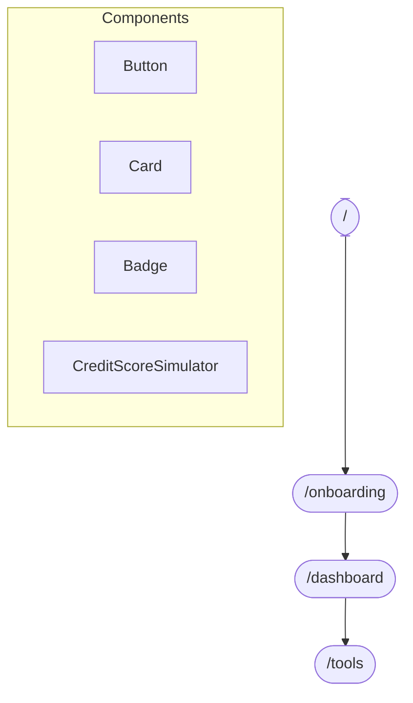

# UI Flow

```mermaid
flowchart TD
  home(["/"]) --> onboarding(["/onboarding"])
  onboarding --> dashboard(["/dashboard"])
  dashboard --> tools(["/tools"])

  subgraph Components
    Button
    Card
    Badge
    CreditScoreSimulator
  end
```
